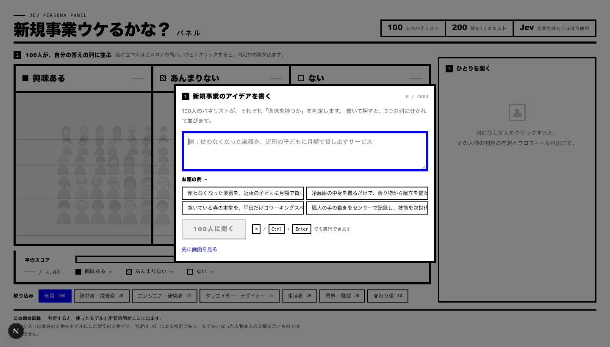
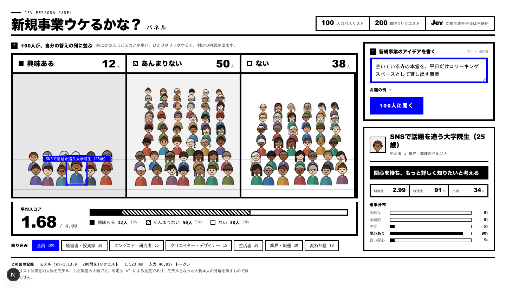
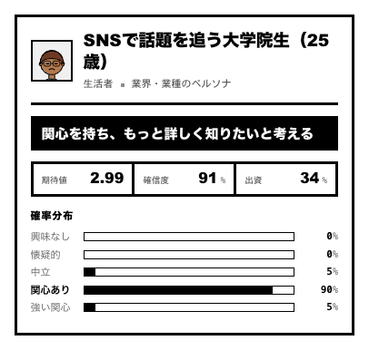

# my-jev-playground

TypeSafe AI の System One モデル **Jev** を使ったサンプルアプリ集です。5つのアプリを1つの Next.js（App Router / React 19）アプリにまとめています。トップページ（`/`）から各アプリへ移動できます。

| アプリ | ルート | 内容 |
|---|---|---|
| 今夜なに作る？ | `/dinner` | 自由入力から今夜の献立（主菜・副菜・汁物）を選ぶ |
| 新規事業ウケるかな？パネル | `/persona` | 新規事業のアイデアに対する100人のパネリストの反応を判定する |
| 探してるものだけ表示 | `/search-filter` | Amazon の検索結果に混ざる、探していない商品を見分けて、探しているものだけを残す |
| 問い合わせ振り分け | `/router` | お客様の問い合わせを Jev 1回で分類し、確信度としきい値で自動対応・確認・人間に振り分ける |
| ソラカー Car Picker | `/car-picker` | 自然文の要望から、架空の販売店「ソラカー」の車種・グレード・色をおすすめ順に出す |
| Jev の使い方 | `/guide` | Jev とは何か、各アプリでの使い方を、たとえ話でやさしく解説する |

## Jev の使いどころ

Jev は TypeSafe AI の「System One」モデルで、文章を生成しません。状況（state）と質問（questions）を渡すと、質問ごとの判断を確率で返します。

質問の型は3つです。noul は「当てはまる確率」（0〜1）、choice は選択肢ごとの確率、score は段階評価の期待値と各段階の確率を返します。

状況（state）は、判断の材料として質問といっしょに渡すテキストです。文字列・JSON オブジェクト・配列で渡せます（画像や音声は不可）。複数の情報があるときは、名前をつけた JSON にして、質問の中から `order.days_since` のようにパスで参照します。1リクエスト内のすべての質問が同じ state を、互いの答えを見ずに独立して評価します。最新の事実はモデルの知識に頼らず、コードが state に入れます。

返ってくるのは構造化された数値だけなので、並べ替え・絞り込み・足し算といった後処理はふつうのコードで書けます。1回の呼び出しで数十〜数百問を並列に評価でき、応答は数百ミリ秒〜1.5秒ほどです。

同じ状況に対する質問は、まとめて1回で聞きます（共有する状況の分だけ、安く速くなります）。質問の数が増えるのは、状況について知りたいことが増えたときです。候補が多いときは、候補ごとに1リクエスト、全候補を1つの質問の選択肢にして絞る、依頼文から条件を取り出す、といった形があります。

たとえ話つきのやさしい解説は、アプリの `/guide` ページ（各ページ上部のナビの「Jev の使い方」）にあります。以下は、実装に沿った技術寄りの説明です。

### /dinner 今夜なに作る？

**ユーザーの状況を state に入れ、料理ごとに「今夜にふさわしいか」を1問ずつ、1リクエストで聞く**

質問の形: `noul × 196（主菜）を1リクエスト、noul × 112（副菜・汁物）を1リクエスト`

何を渡しているか

- state は、`ユーザーの状況`（自由入力）と `あなたのタスク`（今夜の主菜を決める）です。副菜・汁物を選ぶときは、`今夜の主菜` も加えます。
- 料理名は、料理ごとの質問のほうに入れます（`candidate`）。同じ状況に対して、候補ごとの質問を並べる形で、「探してるものだけ表示」と同じです。

どんな質問か

- 料理ごとに noul を1問:「今日の夜ご飯に、`candidate` はふさわしいか？」。主菜196品で196問、副菜・汁物112品で112問です。
- 以前は、全候補を選択肢にした1つの質問で12品に絞ってから、残りを詳しく聞く2段階でした。比べたところ、普通の依頼文では上位がほぼ同じで、今の形のほうが、リクエスト（3回→1回）もトークン（約1.8万→約9,300）も少なかったので、こちらにしました。

結果の使い方

- 「はい」の確率が高い順に並べます。10段階の score でも聞いて比べましたが、順位はほぼ同じで、トークンは約4.7倍でした。
- 確信度（迷いのなさ）で選ぶと、「ふさわしくない」と自信満々に答えた料理（ふさわしい確率 0.08 など）が選ばれてしまいました。確信度は順位には使いません。
- 1回の操作は、主菜 1リクエスト・約0.3秒、副菜・汁物 1リクエスト・約0.2秒です。

コードが担当していること

- 候補の一覧、確率による並べ替え、1位の主菜に合わせて副菜・汁物を聞き直す流れは、すべてコードです。
- Jev は「各候補が今夜にふさわしいか」という判断だけを担当します。

### /persona 新規事業ウケるかな？パネル

**100人分の「興味」と「出資」を、1回のリクエストで200問まとめて聞く**

質問の形: `score × 100 + noul × 100 を1リクエスト`

何を渡しているか

- state は、新規事業のアイデア文（`新規事業のアイデア`）です。
- 質問側に、パネリスト1人ずつの名前・紹介・関心領域を人物として埋め込みます。同じアイデアを、100人の視点から評価させる形です。

どんな質問か

- score（段階評価）: 「この人物は、このアイデアにどの程度興味を持つか」。人物の経歴・価値観・関心領域に照らして判断させ、興味の度合いを複数の段階で答えさせます。
- noul: 「この人物は、自分の資金を出すか」。
- 1人につき2問、100人で200問を、分割せずに1リクエストで投げます（実測 1.5〜1.6 秒）。Jev は1リクエスト内の質問を並列に評価します。

結果の使い方

- score の期待値で、アバターを興味の度合いごとの陣地に立たせます。各段階の確率と、出資の確率は詳細表示に出します。
- パネリストは AI による推定であり、モデルとなった人物本人の見解を示すものではありません。

コードが担当していること

- パネリストの定義（`data/persona/panelists.json`）、陣地への配置、アバターの描画はコードです。
- 資格情報は AI Gateway のキー → TypeSafe のキー → Vercel の OIDC の順に探し、どれも無ければモックモードで動きます。

### /search-filter 探してるものだけ表示

**検索キーワードを state に入れ、商品ごとに1問を、1リクエストにまとめて聞く**

質問の形: `choice × 商品数（16〜27問）を1リクエスト`

何を渡しているか

- state は、検索キーワードだけです。
- 質問は商品ごとに1問で、商品のタイトルを質問のほうに入れます（`candidate: {title}`）。同じ状況に対する質問を、候補ごとに並べる形で、1回のクリックにつきリクエストは1回です。395商品を全部判定しても、24リクエストでした。

どんな質問か

- `p0`〜（choice）: 本命 / 代わり / おまけ / 無関係。各選択肢の説明は、「何を含むか」「何は別の選択肢に属するか」を対比させて書き、全商品で共通です。
- 最初の設計では、検索キーワードの語ごとの質問（はい / いいえ / わからない）や、選択肢を逆の並びにした質問も聞いていましたが、判定への寄与が小さい、または効果が誤差の範囲だったので外しました。

結果の使い方

- 本命と判定された商品を「探してるもの」として緑に光らせ、それ以外には 🚫 を付けます。「探してるものだけ表示」をオンにすると、探してないものを隠します。確信度が 0.6 未満の判定には「Jev が迷った」と印を付けます（しきい値はコード側の定数）。
- 確信度が 0.6 未満の商品は正解率が約5割、それ以上は約8割でした。
- 試作時点（jev-1.13.0、24キーワード・395商品、2026-10-03）の結果は、4分類の一致 約74%、「見るべきか」の一致 約82%、1リクエスト約0.2秒、全体で約0.9円です。商品ごとに分けた作りと、精度は同じでした。

コードが担当していること

- 質問の組み立て（商品のタイトルを質問に入れる）、確率の集計、score、しきい値、並べ替えはコードです。
- 429 / 529 のときの再試行もコードです。1リクエストの質問が多すぎるとき（50件超）は、質問を分けて複数リクエストにします。

### /router 問い合わせ振り分け

**意図を分類し、処理の危険度に応じた確信度で「自動 / 確認 / 人」に振り分ける**

質問の形: `choice × 2（意図を正順・逆順）+ score × 3 + noul × 4 を1リクエスト`

何を渡しているか

- state は、問い合わせの文、お客さんの注文と会員プラン、返金のルールです。質問からは、`customer.orders[0]` のようにパスで指します。
- どの処理先になるかは、まだ決まっていないので、どの経路でも使いそうな質問を最初に全部聞きます（投機的ファンアウト）。使わなかった答えは、コードが捨てます。

どんな質問か

- `intent`（choice）: 注文状況 / 返金 / 解約 / 商品の質問 / クレーム / アカウント / その他。「その他」の逃げ道があり、隣り合う選択肢との境目は、対比で書いています。選択肢を逆の並びにした `intent_rev` も同時に聞き、割れたら低確信にします。
- 緊急度と不満の強さ（score、3段階。別々の次元）、複雑さ（score）。
- 法的な脅し・不審なメッセージ・複数の依頼（noul）。
- `refund_in_policy`（noul）: 返金期間内か。返金の依頼のときだけ使う、先回りの質問です。日数は state に入れ、ルールの文と照らし合わせるだけで、Jev に計算はさせません。

結果の使い方

- 処理の危険度で、必要な確信度を変えます。注文状況の自動返信（低リスク）は 0.6 以上で自動、返金と解約（高リスク）は 0.85 以上で自動、中間は確認、低ければ人に回します。
- 確信度は、その経路で決め手になる答えのうち、一番弱いものを全体の確信度にします。
- 不審なメッセージと法的な脅しは、意図に関係なく人に回します。複数の依頼があるときは、自動を確認に格下げします。
- しきい値は画面で変えられ、変えても Jev は呼び直しません。

コードが担当していること

- 危険度ごとのしきい値、処理先の選択、確信度の計算はすべてコードです。
- 返金期限の日数計算はコードの範囲ですが、このデモでは、日数をstateに入れて文と照らす形にしています。
- 実際の返金や解約は実行しません（判定までを見せるデモです）。

### /car-picker ソラカー Car Picker

**30問を1回の呼び出しでまとめて聞き、あとはコードが車種とオプションを選ぶ**

質問の形: `choice × 6 + score × 2 + noul × 22 を1リクエスト`

何を渡しているか

- state は、ユーザーの要望文（`request`）だけです。
- 車種を選ぶための質問と、車種が決まったあとにオプションを選ぶための質問を、最初に全部まとめて聞きます（投機的ファンアウト）。どの回答が必要になるかはコードが後から決めるので、2回目の呼び出しをしません。

どんな質問か

- 「言及があるか」と「どの値か」を別の質問にします。ボディタイプ・人数・色・燃料・グレードの5項目それぞれに、`*_stated`（noul）と、「言及なし」の選択肢を持たない値の choice があります。書かれていない項目を、Jev が無理に埋めません。
- bodyType は、選択肢を逆の並びにして2回聞き（`bodyType_reversed`）、1位が食い違ったら低確信として扱います。
- score 2問（月額の安さの重視度、安全装備の重視度）。段階の説明は、1つの軸だけを測る、具体的な文にしています。
- noul: 子どもが乗るか、スライドドア希望か、4WD希望か、オプションの欲求 14問。同じ信号を二重に聞かないよう、重複する質問は削り、コードが導出しています。

結果の使い方

- 言及の確率に応じて、その項目の順位への影響を弱めます。
- 決め手になった回答のうち、一番確信度が低いものを全体の確信度にします（公式の関数呼び出しの考え方：最も弱い判断が全体を決める）。
- 確信度が低く、しかも上位の入れ替わりに効く項目があれば、「ミニバン？ SUV？」のように聞き返します。選んでもらったら、コードで答えを上書きして、Jev を呼び直さずに並べ直します。重みのスライダーも同様です。

コードが担当していること

- 価格や装備などの事実は、カタログ（`data/car-picker/catalog.json`）から取ります。Jev に値の抽出や計算はさせません。
- ランキング、ボディタイプの近さ、オプションの選択、月額の合計、確信度の計算はすべてコードです。
- キーが無いときや失敗したときは、キーワードによるオフライン判定に切り替えます（確率ではなく、ルールの結果と表示します）。

## Jev のやりとりを見る

どのアプリでも、その画面で Jev を1回でも呼ぶと、右端に「Jev のやりとり」タブ（数字はリクエスト数）が出ます。押すと右からパネルが開き、直前の操作で Jev に **送ったもの（リクエスト）** と **受け取ったもの（レスポンス）** をそのまま JSON で見られます（× / 背景クリック / Esc で閉じる）。

- 送ったものは `model` / `state` / `questions`（`choice()` などが作ったあとの、実際に送る形）、受け取ったものは `model` / `answers` / `usage` です。1回の操作で複数リクエストになる場合（/dinner の主菜＋副菜・汁物、50件を超える /search-filter など）はタブで切り替えます。
- 「JSON をコピー」と「curl をコピー」があります。curl は `$TYPESAFE_API_KEY` をそのまま書いた形なので、キーを環境変数に入れて実行すればターミナルで同じリクエストを再現できます。
- API キーやヘッダーは画面にも API の応答にも含めません。記録はどこにも保存せず、次に Jev を呼ぶと置き換わります（Jev を呼ばない操作、たとえば /car-picker の再ランクでは直前のものが残ります。/persona のモックモードでは何も出ません）。
- 実装は `lib/common/jev-trace.ts`（記録）と `components/common/jev-drawer.tsx`（パネル）。各 Route Handler は応答に `jev: JevTrace[]` を含めます。

## 構成

```
app/
├── (home)/                 トップページ（独自の root layout と globals.css）
├── (searchfilter)/search-filter/            /search-filter
├── (dinner)/dinner/        /dinner
├── (carpicker)/car-picker/          /car-picker
├── (persona)/persona/      /persona（icon.svg を含む）
├── (router)/router/        /router
├── (guide)/guide/          /guide（やさしい解説）
└── api/{search-filter,dinner,car-picker,persona,router}/...   各アプリの Route Handler
components/{search-filter,dinner,car-picker,persona,router,common}/
lib/{search-filter,dinner,car-picker,persona,router}/
data/{search-filter,dinner,car-picker,persona,router}/
docs/persona/               persona のスクリーンショット
```

各アプリは route group ごとに **独立した root layout**（`<html>` / `<body>` と専用の `globals.css`）を持ち、スタイルが互いに漏れません。そのためアプリ間の移動は通常のページ遷移（全体読み込み）です。各ページの上部に、パンくず・アプリ切り替え・解説（`/guide`）へのリンクを並べたナビ（`components/common/site-nav.tsx`）を置いています。

## ローカルで動かす

API キーは `.env` に書かず、macOS キーチェーン（サービス名 `TYPESAFE_API_KEY`）から渡します。

```bash
bun install
TYPESAFE_API_KEY=$(security find-generic-password -s TYPESAFE_API_KEY -w) bun run dev
```

http://localhost:3000 を開きます。未登録の場合は `security add-generic-password -a "$USER" -s TYPESAFE_API_KEY -w` で登録してください。

```bash
bun run typecheck   # 型チェック
bun run check       # Biome（lint + format）
bun run build       # 本番ビルド
bun run start       # 本番サーバー
```

ツールのバージョンは `mise.toml`（bun 1.4.2 / node 24.21.0）で固定しています。

## 環境変数

すべてサーバー側でのみ使います。`NEXT_PUBLIC_` は付けないでください（ブラウザに漏れます）。テンプレートは `.env.example` です。

| 名前 | 対象 | 内容 |
|---|---|---|
| `TYPESAFE_API_KEY` | 全アプリ | TypeSafe AI（Jev）の API キー。未設定時の挙動は各アプリの節を参照 |
| `JEV_MODEL` | search-filter / car-picker | 使う Jev のモデルを固定（既定 `jev-latest`） |
| `FORCE_OFFLINE` | car-picker | `true` でキーがあってもキーワード判定を使う |
| `AI_GATEWAY_API_KEY` | persona | Vercel AI Gateway のキー（`TYPESAFE_API_KEY` より優先） |
| `TYPESAFE_DEFAULT_MODEL` | persona | モデルの上書き（既定 `jev-latest`、Gateway 経由では `typesafe-ai/jev`） |

## Vercel へのデプロイ

Vercel のプロジェクトは **1つ** です。リポジトリを Import し、**Root Directory は既定のまま**（指定不要）、Framework Preset は Next.js（自動検出）でデプロイします。環境変数に `TYPESAFE_API_KEY` を登録してください（Sensitive 推奨）。

persona は `TYPESAFE_API_KEY` が無くても、Vercel 上では OIDC トークン経由で AI Gateway につながります（後述）。

各 Route Handler の `maxDuration`（search-filter 判定 60 秒 / dinner 60 秒 / car-picker 60 秒 / persona 60 秒 / router 30 秒）は route ファイル内の export で指定しています。

## 各アプリのメモ

### /dinner 今夜なに作る？

- 主菜（`POST /api/dinner/recommend`）: state は `{ ユーザーの状況, あなたのタスク }`。全196品に「今日の夜ご飯に、`candidate` はふさわしいか？」の noul を1問ずつ並べ、1リクエストで聞きます。「はい」の確率の高い順に上位12品を返します。
- 副菜・汁物（`POST /api/dinner/sides`）: state に `今夜の主菜` を加え、副菜・汁物112品に同じ形の noul を1問ずつ、1リクエストで聞きます。
- 測定（2026-10-04, jev-1.13.0）: 主菜は 1リクエスト・入力約9,300トークン・約0.3秒、副菜・汁物は 1リクエスト・入力約8,000トークン・約0.2秒。以前の2段階（Choice で12品に絞ってから score と noul）は主菜だけで3リクエスト・約1.8万トークンで、普通の依頼文では上位がほぼ同じでした。10段階の score でも順位はほぼ同じで、トークンは約4.7倍。確信度で選ぶと「ふさわしくない」と自信を持って答えた料理が選ばれたので、順位は確率で付けます。
- メニューは `lib/dinner/menus.ts`、画面に出す1行説明は `data/dinner/dish-notes.json` です（説明は Jev には渡していません）。
- キー未設定のときは API が 503 を返し、画面にエラーが表示されます。

### /persona 新規事業ウケるかな？パネル

アイデアを入力すると、100人のパネリストが「興味を持つか」を判定し、興味の度合いごとの陣地にアバターが立ち並びます。判定は Jev（LLM は使いません）。





- `POST /api/persona/judge` に送ると、100人分の「興味の度合い」＋「自分の資金を出すか」= 計200問を Jev に1リクエストで投げます（実測 1.5〜1.6 秒）。
- パネリストは実在の人物をモデルにした架空の人物43名と、業界・職種のアーキタイプ57名です。判定は AI による推定であり、モデルとなった人物本人の見解を示すものではありません。`data/persona/panelists.json` を編集すると差し替えられます（`profile` と `interests` を必ず Jev に渡します）。
- 資格情報は `lib/persona/jev.ts` が次の順で探します。

  | 順 | 資格情報 | 経路 |
  | --- | --- | --- |
  | 1 | `AI_GATEWAY_API_KEY` | AI Gateway |
  | 2 | `TYPESAFE_API_KEY` | TypeSafe へ直接 |
  | 3 | Vercel の OIDC トークン | AI Gateway（秘密を置かずに済む。設定不要） |
  | — | なし | モックモード（疑似スコア。画面上部に警告） |

  OIDC を使うときは、鍵のほうを消します（Project → Settings → Security → Secure Backend Access を有効に）。AI Gateway の無料枠は上流混雑で失敗が混ざります（実測で10回中3回ほど）。自分の TypeSafe キーで直接叩く場合は安定して約 700ms でした。
- `/api/persona/judge` は誰でも叩ける公開エンドポイントです。OIDC / Gateway を使う場合は、AI Gateway 側でプロジェクトに予算上限（Budget）を設定してください。
- Node.js ランタイム（SDK が Node.js 20 以上を要求するため Edge は不可）。

### /search-filter 探してるものだけ表示

- データ: [Shopping Queries Dataset (ESCI)](https://github.com/amazon-science/esci-data)（Apache-2.0）の日本語サブセットから 24 キーワード（`data/search-filter/demo.json`）。
- 「Jev で判定」1回 = Jev 1 リクエスト（そのキーワードの 16〜27 商品ぶん）。`state` は `{ search_query }` だけ。同じ state に対する質問を、商品ごとに `choice` 1問（id は `p0`, `p1`, …）として 1 リクエストに並べます。商品が読むべき文章（タイトル）なので、質問の `instructions` に `{ question, candidate: { title } }` として入れ、4 つの選択肢（exact / substitute / complement / irrelevant）の説明は全商品で共通です。検索語ごとの条件質問や、選択肢を逆順にした質問はありません（測定で効果が誤差程度だったため）。50 商品を超えるキーワードがあれば、質問を分けて複数リクエストにします（1リクエスト 64k トークンの上限対策。`judgeQuery`）。
- 画面: 本命（exact）と判定された商品は緑に光り、それ以外には 🚫 が付きます。「探してるものだけ表示」をオンにすると、探してないものを隠します。Jev の `confidence` が 0.6 未満の判定には「Jev が迷った」と点線の印を付けます（`lib/search-filter/score.ts` の `LOW_CONFIDENCE`）。
- API: `GET /api/search-filter/queries`、`GET /api/search-filter/judge/[qi]`（JSON: 商品ごとの `answers` と `stats`）。
- キー未設定のときは商品一覧のみ表示し、「Jev で判定」ボタンは無効になります。
- 測定（2026-10-03, jev-1.13.0, 24 キーワード・395 商品）: 24 リクエスト・入力約 13.6 万トークン・1 リクエスト約 210ms・全体で約 0.9 円。4 分類の一致 74.4%、「exact か否か」82.0%。商品ごとに 1 リクエスト（商品の全情報）の旧設計は 74.4〜74.9% / 82〜82.5% でほぼ同じ精度で、リクエスト数は 395 → 24、入力トークンは約 38%。
- 確信度ごとの 4 分類一致率:

  | confidence | 件数 | 一致率 |
  | --- | --- | --- |
  | 0.4 未満 | 21 | 42.9% |
  | 0.4〜0.5 | 25 | 56.0% |
  | 0.5〜0.6 | 26 | 53.8% |
  | 0.6〜0.7 | 30 | 70.0% |
  | 0.7〜0.8 | 33 | 75.8% |
  | 0.8〜0.9 | 52 | 76.9% |
  | 0.9 以上 | 208 | 82.2% |

  0.6 未満（72 件）は一致率 51%、0.6 以上（323 件）は 80% なので、`LOW_CONFIDENCE = 0.6` にしています。
- 既知の制限: 質問に入れるのはタイトルだけなので、特徴・説明文にしか書かれていない条件（容量・対応機種など）は見落とすことがあります。
- データ作成用のスクリプト（ESCI の parquet から `demo.json` を作る）は含めていません。

### /router 問い合わせ振り分け

- 公式パターン [Intent Routing](https://docs.typesafe.ai/patterns/intent-routing.md)（意図を分類し、いちばん安い担当に回す）と [Confidence-Gated Routing](https://docs.typesafe.ai/patterns/confidence-routing.md)（答えは何をするかを、確信度は実行してよいかを教える）を組み合わせたサンプルです。サポートへの問い合わせ 1 通を Jev に 1 リクエストで聞き、「自動で対応（AUTO）/ 確認してから実行（CONFIRM）/ 人に回す（HUMAN）」はコードで決めます。振り分け先の処理はデモで、実際には実行しません。
- 1 リクエスト = 9 問（すべて独立の投機的ファンアウト）。`state` は `{ message, customer: { plan, orders[] }, refund_policy }`（顧客と注文は `data/router/customer.json` の固定デモデータ）で、質問からは `` `message` `` や `` `customer.orders` `` のようにパスで指します（`lib/router/questions.ts`）。
  - `intent`（choice 7 択、「その他」あり）と、選択肢を逆順にした `intent_rev`。コードで平均し、並び順を変えて最頻値が変わったら確信度を 0.30 に抑えます（Choice の並び順バイアス対策）。
  - `urgency`・`frustration`・`complex_case`（score 3 段階。次元ごとに 1 問）。
  - `legal_threat`・`suspicious`・`multiple_requests`（noul）。
  - `refund_in_policy`（noul、投機的）: 返金依頼のときだけ使い、それ以外では捨てる質問です。「到着から何日か」の計算は Jev にさせず、`days_since_delivery` を state に入れ、ポリシーの文と照らし合わせるだけにしています。
- 振り分けのロジックは `lib/router/route.ts` だけで、**しきい値は 1 か所（`DEFAULT_THRESHOLDS`）にリスクレベル別に集約**しています。取り返しのつかない操作ほど、自動実行に高い確信度を求めます。

  | リスク | 振り分け先 | AUTO | CONFIRM | それ未満 |
  | --- | --- | --- | --- | --- |
  | 低 | 定型返信（注文状況・商品の質問） | 0.60 以上 | 0.50 以上 | HUMAN |
  | 中 | アカウント復旧案内 | 0.70 以上 | 0.50 以上 | HUMAN |
  | 高 | 返金処理・解約手続き | 0.85 以上 | 0.60 以上 | HUMAN |

  - 確信度は「この経路で実際に使った答えのうち最も弱いもの（weakest link）」です。intent は上の平均後の確信度、返金は `refund_in_policy` の P(はい) も含めます。クレームは `complex_case` の確信度を含め、`complex_case` / `frustration` / `urgency` の期待値が 1.5 以上なら下書きではなく人に回し、そうでなければ「AI の下書き + 担当者確認」（CONFIRM）にします（自動送信はしません）。
  - 先に判定するもの: `suspicious` ≥ 0.5 → セキュリティ担当、`legal_threat` ≥ 0.4 → 法務（見逃しのほうが高くつくので低め）、どちらも意図に関係なく人間へ。意図が `other` や、全体の確信度が 0.50 未満でも人間へ。`multiple_requests` ≥ 0.5 のときは、AUTO を CONFIRM に格下げします。
- 画面には、判定カード（理由つき）、Jev の答えの表（確率・確信度・最弱の環・その答えが今回どう使われたか）、リスク別のしきい値表（数値を編集すると**Jev を呼ばずに**ブラウザ内で即座に再判定）を出します。
- API: `POST /api/router/classify`（`{ message }` → 各質問の生の答えと `stats`。振り分けはブラウザ側のコード）。`TYPESAFE_API_KEY` が無いときは 503 と日本語のメッセージを返します。
- 測定（2026-10-03, jev-1.13.0, 12 サンプル）: 1 リクエストあたり約 190〜300ms（平均約 205ms）、入力約 2,100 トークン・出力約 260 トークン。
- 限界: 振り分け先の処理はデモで何も実行しません。正解ラベルはなく、サンプルの結果が妥当かを人が見ているだけです（精度は測っていません）。メッセージは日本語で、英語の説明文より多少弱い可能性があります。しきい値は例であり、実運用ではログを見て調整してください。「軽いクレーム」のように `complex_case`（3 段階の難しさ）の確信度が 0.5 前後で、実行のたびに CONFIRM と HUMAN の間を揺れる入力があります（それが低確信度の意味どおりの挙動です）。

### /car-picker ソラカー Car Picker

- 架空の販売店「ソラカー」を想定したデモです。販売店名・メーカー名・車名・一部の装備名は架空のもの（実在の車種がわかる程度に変えてあります）で、価格や装備などの数値は実在のカタログを参考にした検証用データです。実際の販売店・車種とは関係ありません。
- Jev の「投機的ファンアウト」がこの用途に合うかを確かめる検証用アプリ。**Jev は1回だけ呼び**（30問）、車種・グレード・色の切り替えや、チップ・スライダーでの再ランクでも再度は呼びません。価格・装備・色の計算はコードがカタログ（`data/car-picker/catalog.json`、約 850KB）から行います。
- Jev が失敗したとき、またはキーが無いときは、キーワード判定（オフライン）に切り替わります（画面右の切り替えで手動でも可）。Jev のタイムアウトは 15 秒＋リトライ1回。
- API: `POST /api/car-picker/recommend`、`POST /api/car-picker/rerank`（Jev を呼ばない再ランク）、`GET /api/car-picker/catalog`。
- 割り切り: PDF の読み取りに不確かな箇所があり、標準装備の判定はルールの部分一致による近似です。対象は10車種（ヤリオ、シエルタ、プリウム、コローラ クロス、コローラ ツーリング、クラウネ（セダン）、ノーア、ハリアス、ヤリオ クロス、ルーミア）。PHEV とフルサービス型プラン（アンリミテッド）のグレードは対象外。`/api/car-picker/recommend` の応答には全車種・全グレードの採点結果が入ります（数百KB）。
- カタログの作り直し用スクリプトと元データは含めていません。

## ライセンス

[MIT](LICENSE)
